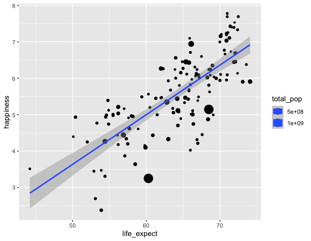

```{r setup, include=FALSE}
knitr::opts_chunk$set(echo = TRUE)
```

## Install and Load Packages

Load the tidyverse package (includes ggplot and dplyr) using`library(tidyverse)`

Note: If you dont have the tidyverse package installed on your computer already, you will need to install it using `install.packages('tidyverse')`

```{r}

install.packages('tidyverse')

library(tidyverse)

```

## Read in Data

1.  Set your working directory (this will be specific to your computer and the path to the folder)
2.  Read in happiness2019.csv file and name the data frame "happy"
3.  Take a look at data using `view(happy)`,

```{r}


```

## Make a scatterplot

*Recreate the following figure:*

{width="50%"}

Steps:

1.  Make a scatterplot that shows the relationship between life expectancy and happiness, where each country is a point on the graph

2.  Adjust the size of each point to represent the total population of the country represented by each point

3.  Add a linear regression line using stat_smooth(me)

    Hint: Remember the main structure of a ggplot function:

    `ggplot(data, aes(x variable, y variable)) + geometry`

```{r Answer}


```

## Make a barplot

1.  Use `geom_col()` to show the total population of each continent
2.  Change the color of the bars so that each continent is represented by a different color. (Hint: `col=` will only change the line around the bars, so you will need to use `fill=` instead)

```{r Answer}


```

## 
